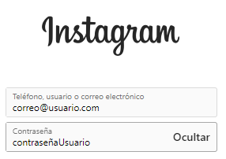
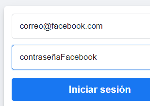
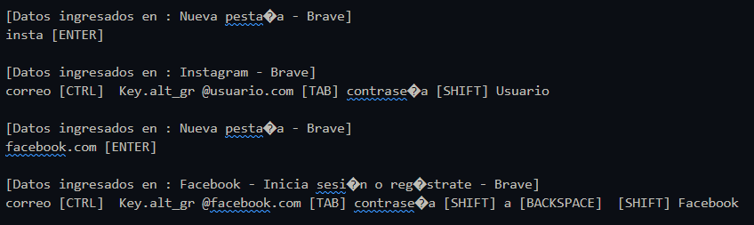

# PythonLogger

Este proyecto muestra el código de un keylogger sencillo y de igual forma se muestra cómo ocultar código para que este no sea encontrado

## Instalación

```bash
git clone https://github.com/brianrscode/pythonlogger.git
```

## Ejecución en windows

```bash
python pythonlogger.py
```
## Ejecución en Linux o Mac
```bash
python3 pythonlogger.py
```

## Hacer cambios en el código
Si modificó el código `codigoKeylogger.py` y desea generar una nueva cadena cifrada entonces ejecute:
```bash
python ocultarCodigo.py
```
y en caso de estar en Linux o Mac, use:
```bash
python3 ocultarCodigo.py
```
Una vez generada su nueva cadena cifrada, debe copiarla y pegarla en la variable `codigo` del archivo `pythonlogger.py`

## Capturas del funcionamiento

Se introducen datos en cualquier lugar, en este caso fue en Instagram y Facebook:<br>
<div align="center">
    
    <br>
    
    <p align="left">Los datos ingresados serán agregados al archivo de la siguiente forma:</p>
    
</div>


## Código malicioso

El código malicioso oculto se encuentra en el archivo `codigoKeylogger.py`. Este archivo se comprime y codifica en base64 utilizando el script `ocultarCodigo.py`. <!-- Para descifrar y ejecutar el código malicioso, ejecute el script `descifrar_codigo.py`. -->

**Nota: Este código malicioso se proporciona con fines educativos únicamente. No se recomienda su uso malintencionado.**

## Licencia

Este proyecto se distribuye bajo la licencia MIT. Consulte el archivo LICENSE para obtener más detalles.
